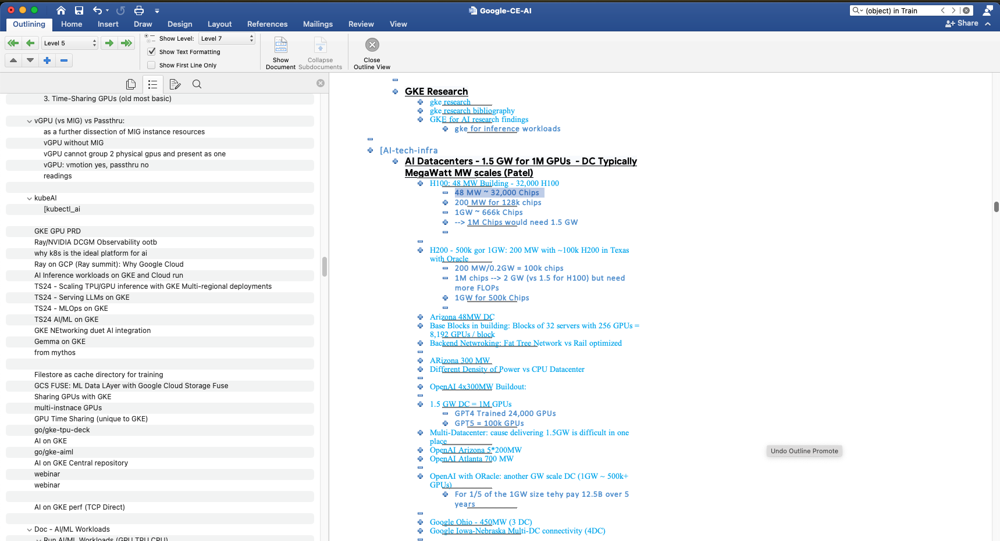
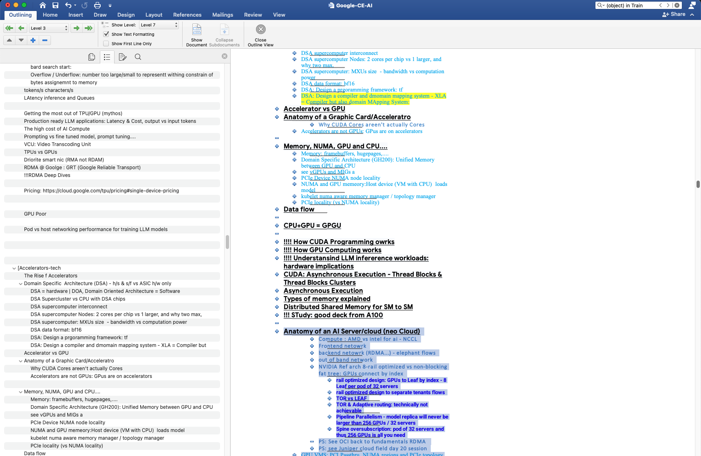
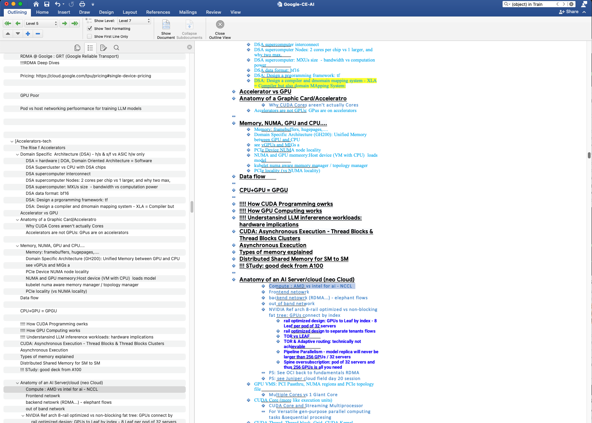
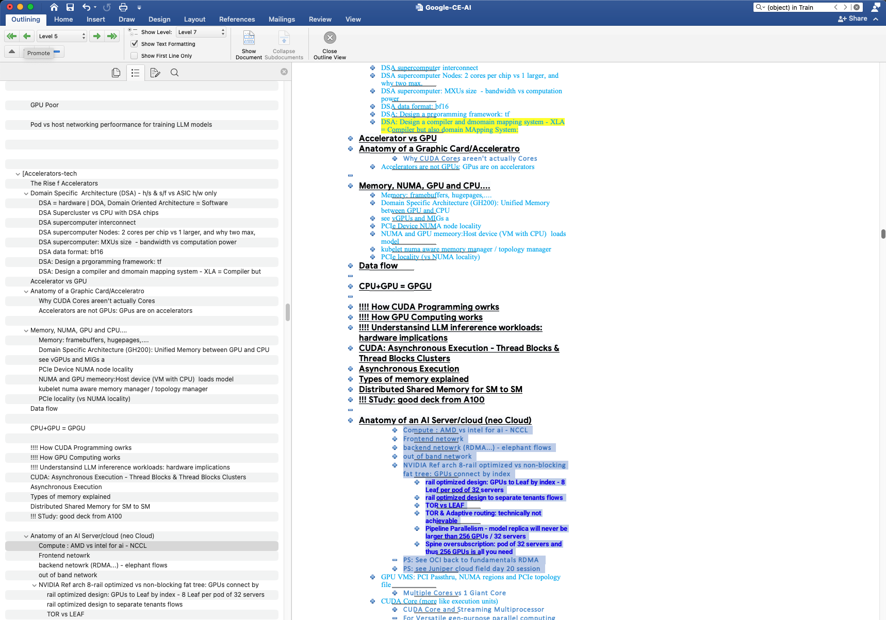
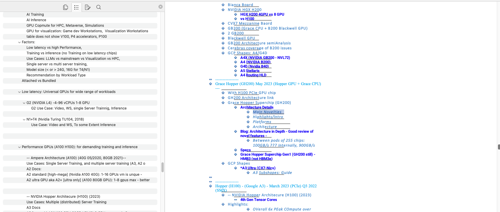
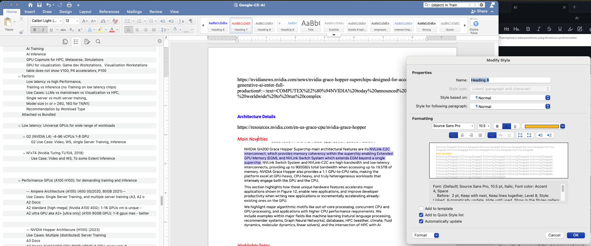
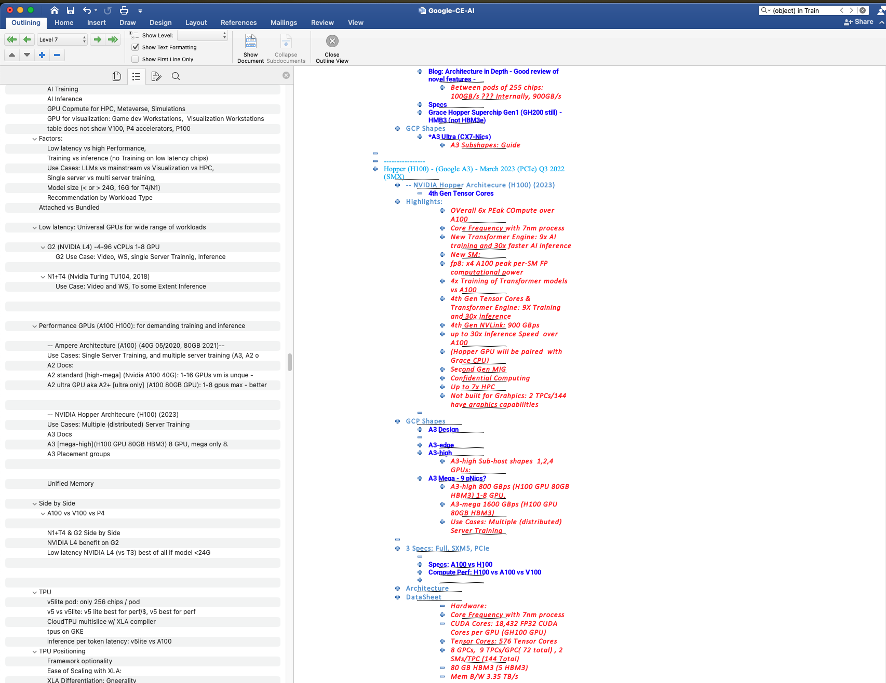
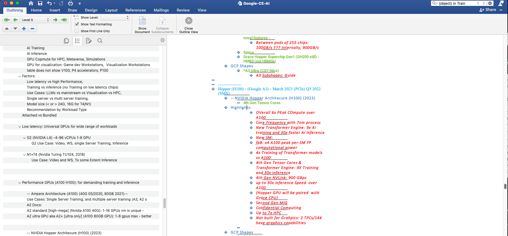

Local Repo:
```bash 
cd /Users/meillier/Documents/02-CE\ Role/01-Encyclopedia/00-pandoc
```


git repo:
https://github.com/ymeillier/00-pandoc


> [!Note]
This is the workflow i used to convert my humongous .docx documents to markdown 

```bash
pandoc ../Google-CE-AI.docx -f docx -t markdown_mmd --lua-filter=../Lua-base2.lua --extract-media="." --wrap=none -o "AI.md"
```


## 1. What is Pandoc and How to Install It

**Pandoc** is a powerful command-line tool known as the "universal document converter." Unlike simple copy-paste methods, Pandoc understands the underlying structure of a `.docx` file, allowing it to extract embedded images and manipulate document metadata.

### How to Install on macOS:

The easiest way is via **Homebrew**:

Bash

```
brew install pandoc
```

Alternatively, you can download the `.pkg` installer from the [Pandoc GitHub Releases page](https://github.com/jgm/pandoc/releases).

---

## 2. What is a Lua Filter?

A **Lua Filter** is a small script that Pandoc uses to modify a document _during_ the conversion process. Since Markdown natively stops at Level 6 ($h6$), we use these scripts to "catch" Level 7–10 headings and transform them into Level 6 headings while preserving their original context in the title.

### Version 1: Full Path (Complete Hierarchy)

This version includes every parent level in the title, separated by pipes.

- **Result:** `###### Level 1 | Level 2 | ... | Level 7`
    

Lua

```
local heading_stack = {}

function Header(el)
  heading_stack[el.level] = pandoc.utils.stringify(el.content)
  for i = el.level + 1, 10 do heading_stack[i] = nil end

  if el.level > 6 then
    local prefix_parts = {}
    for i = 1, el.level - 1 do
      if heading_stack[i] then table.insert(prefix_parts, heading_stack[i]) end
    end
    local new_title = table.concat(prefix_parts, " | ") .. " | " .. pandoc.utils.stringify(el.content)
    return pandoc.Header(6, pandoc.Str(new_title), el.attr)
  end
  return el
end
```

### Version 2: Smart Breadcrumb (Cleaner Sidebar)

This version only includes the immediate parent and a "..." indicator to keep the 'Quiet Outline' sidebar from becoming too cluttered.

- **Result:** `###### ... Immediate Parent | Level 7`
    

Lua

```
local heading_stack = {}

function Header(el)
  heading_stack[el.level] = pandoc.utils.stringify(el.content)
  for i = el.level + 1, 10 do heading_stack[i] = nil end

  if el.level > 6 then
    local parent_title = ""
    for i = el.level - 1, 1, -1 do
      if heading_stack[i] then parent_title = heading_stack[i]; break end
    end
    local short_title = "... " .. parent_title .. " | " .. pandoc.utils.stringify(el.content)
    return pandoc.Header(6, pandoc.Str(short_title), el.attr)
  end
  return el
end
```

---

## 3. How to Run the Pandoc Command

To perform the conversion, place your `.docx` file and your chosen `.lua` script in the same folder. Run the following command in your Terminal:

Bash

```
pandoc "YourDocument.docx" \
  -f docx \
  -t markdown_mmd \
  --lua-filter=your_filter_name.lua \
  --extract-media="." \
  --wrap=none \
  -o "FinalNote.md"
```


### Key Parameters:

- **`--extract-media="."`**: Automatically saves all images from the Word doc into a `/media` folder and links them in the Markdown file.
    
- **`--wrap=none`**: Ensures your text doesn't have artificial line breaks, making it easier to read in Obsidian.
    
- **`-t markdown_mmd`**: Generates MultiMarkdown, which is highly compatible with Obsidian's features.

## Word Pre-processing
My word document sometimes skipped heading levels by mistake. For example a header at level 4 with subheaders at level 6.
before converting the word document to markdown, review the word document in outline view, displaying level up to lvl 7 and scroll to validate no subsections skip a level


For example 'Anatomy of an AI Server/Cloud (Neo CLoud)' is a level 3 header


but the subsection directly underneath is a level 5:

highlight the sections to be moved and adjust left:


we have some true level 7 headers here for example

however we should be able to shift that down one level when create dedicated md files for the lvl1 sections of the word documents. 
IT is not a good practice to have one large md file as at some point its content will not be able to pushed to github when it reaches too large of a size. 


I also made sure to udate hte formatting of sections lvl7 and above to a red hue so that they are easily identfiable in outline view


and now in outline view:

i also make lvl 6 green so that if we ever see blue jumping to red or orange, a heading level is being skipped

such as in this case here 



